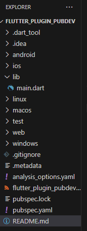
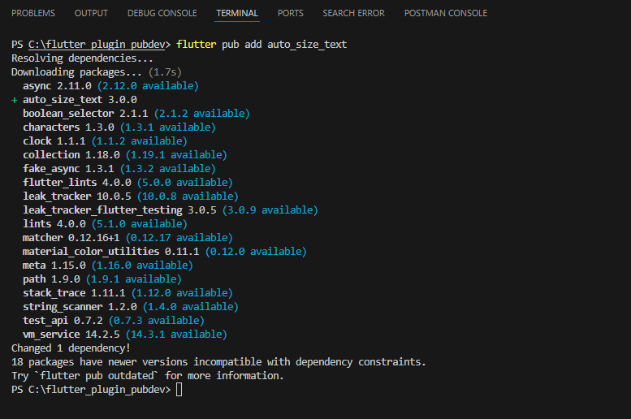
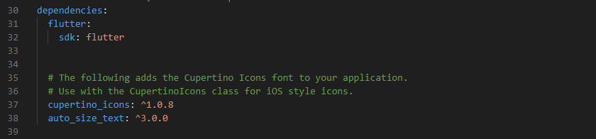
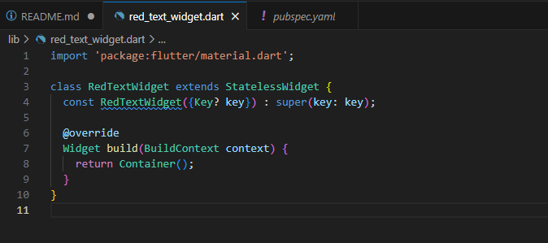
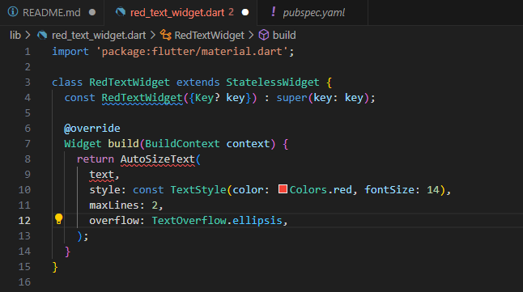
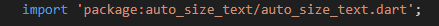
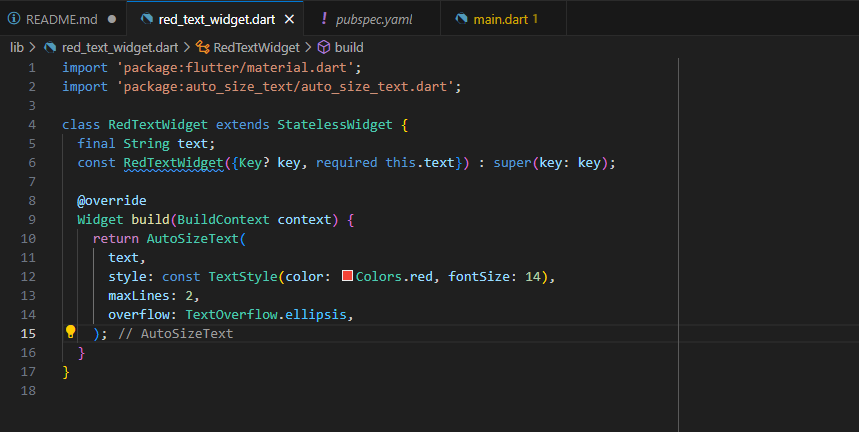
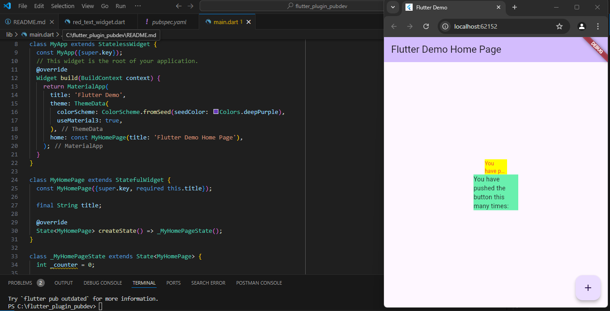

Nama : Febby Mathelda Silvya Mooy

Kelas : TI-3A

NIM: 2241720067

Tugas praktikum

1. Selesaikan Praktikum tersebut, lalu dokumentasikan dan push ke repository anda berupa screenshoot hasil pekerjaan beserta penjelasannya di file readme.md

Jawab:

Langkah 1

Pada langkah pertama ini, kita membuat sebuah project flutter dengan nama flutter_plugin_pubdev yang kemudian akan dijadikan repository pada github

Langkah 2:

Tambahkan plugin auto_size_text menggunakan perintah berikut di terminal

Jika berhasil maka akan muncul tampilan nama plugin beserta versinya pada file pubspec.yaml

Langkah 3:

Buat file baru bernama red_text_widget.dart di dalam folder lib lalu isi kode seperti berikut.

Kode ini adalah widget Flutter bernama RedTextWidget yang mewarisi StatelessWidget. widget ini hanya mengembalikan Container kosong tanpa properti tambahan. 

Langkah 4:

kode ini berfungsi untuk menampilkan teks yang bersifat dinamis menggunakan widget AutoSizeText.

code tersebut error karena properti text yang digunakan pada widget AutoSizeText belum didefinisikan didalam class RedTextWidget.

untuk memperbaiki code ini kita harus menambahkan parameter atau variabel text ke dalam class RedTextWidget.

Langkah 5:

Langkah 6:

2. Jelaskan maksud dari langkah 2 pada praktikum tersebut!

Jawab:

Langkah 2 ini bertujuan untuk menambahkan plugin auto_size_text ke dalam proyek Flutter dengan perintah flutter pub add auto_size_text, yang secara otomatis menambahkan nama dan versi plugin tersebut di file pubspec.yaml pada bagian dependencies.

3. Jelaskan maksud dari langkah 5 pada praktikum tersebut!

Jawab:

Langkah 5 ini bertujuan untuk membuat variabel text sebagai data yang akan ditampilkan oleh widget. Dengan menambahkan final String text;, dapat mendefinisikan variabel text yang bersifat final (tidak bisa diubah setelah diinisialisasi). Pada constructor RedTextWidget, parameter required this.text memungkinkan untuk menginisialisasi text saat membuat instance RedTextWidget, menjadikannya nilai yang wajib diisi setiap kali widget ini digunakan.

4. Pada langkah 6 terdapat 2 widget yang ditambahkan, jelaskan fungsi dan perbedaannya!

Jawab:

Pada langkah 6, terdapat dua widget Container yang ditambahkan dalam children, masing-masing berisi widget teks namun dengan cara yang berbeda.

Container pertama:

Berisi RedTextWidget, yaitu widget kustom yang telah dibuat.
RedTextWidget menggunakan AutoSizeText sehingga teks akan otomatis menyesuaikan ukuran agar sesuai dengan lebar yang diberikan (dalam hal ini, width: 50).
Fungsi AutoSizeText di dalam RedTextWidget adalah untuk mengurangi ukuran teks secara otomatis jika teks terlalu panjang untuk ruang yang tersedia, sehingga cocok untuk tampilan dinamis.

Container kedua:

Berisi Text biasa, tanpa fitur penyesuaian otomatis.
Teks di sini akan memiliki ukuran tetap sesuai dengan TextStyle default atau yang ditentukan. Jika teks terlalu panjang dan tidak cukup ruang (dalam hal ini, width: 100), teks mungkin akan terpotong atau melimpah keluar tanpa menyesuaikan ukuran.

Perbedaan Utama:

RedTextWidget dengan AutoSizeText memungkinkan teks menyesuaikan ukuran secara otomatis, sedangkan Text di Container kedua tidak memiliki penyesuaian otomatis sehingga ukuran teks tidak berubah meskipun ruangnya terbatas.

5. Jelaskan maksud dari tiap parameter yang ada di dalam plugin auto_size_text berdasarkan tautan pada dokumentasi ini !

Jawab:

- Key : Mengontrol bagaimana widget digantikan oleh widget lain di dalam widget tree

- textKey: Menetapkan key untuk widget Text yang dihasilkan.

- style: Menentukan gaya teks (seperti warna, ukuran font, dan lainnya) yang akan digunakan jika tidak null.

- minFontSize: Ukuran teks minimum yang diizinkan ketika teks secara otomatis menyesuaikan ukuran. Diabaikan jika presetFontSizes disetel.

- maxFontSize: Ukuran teks maksimum yang diizinkan ketika teks secara otomatis menyesuaikan ukuran. Diabaikan jika presetFontSizes disetel.

- stepGranularity: Ukuran langkah yang digunakan untuk mengadaptasi ukuran font sesuai batasan yang ada.

- presetFontSizes: Menentukan semua ukuran font yang mungkin secara eksplisit. Harus diatur dalam urutan menurun.

- group: Menyinkronkan ukuran beberapa AutoSizeText agar konsisten.

- textAlign: Menentukan bagaimana teks harus diratakan secara horizontal.

- textDirection: Mengatur arah teks, yang menentukan cara interpretasi nilai textAlign seperti TextAlign.start dan TextAlign.end.

- locale: Menentukan pemilihan font ketika karakter Unicode yang sama dapat dirender berbeda berdasarkan lokal.

- softWrap: Menentukan apakah teks harus dipisah pada soft line breaks.

- wrapWords: Menentukan apakah kata-kata yang tidak muat dalam satu baris harus dipisah. Default-nya adalah true untuk meniru perilaku Text.

- overflow: Mengatur bagaimana overflow visual ditangani (misalnya, jika teks terlalu panjang untuk ruang yang tersedia).

- overflowReplacement: Widget pengganti yang akan ditampilkan jika teks meluap dan tidak muat dalam batasnya.

- textScaleFactor: Menentukan jumlah piksel font untuk setiap piksel logis. Juga mempengaruhi minFontSize, maxFontSize, dan presetFontSizes.

- maxLines: Batas jumlah baris maksimum yang dapat digunakan oleh teks.

- semanticsLabel: Label semantik alternatif untuk teks ini, digunakan untuk meningkatkan aksesibilitas.

6. Kumpulkan laporan praktikum anda berupa link reposiroty github kepada dosen!